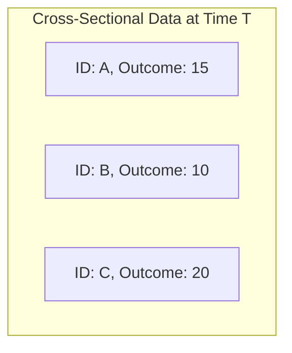
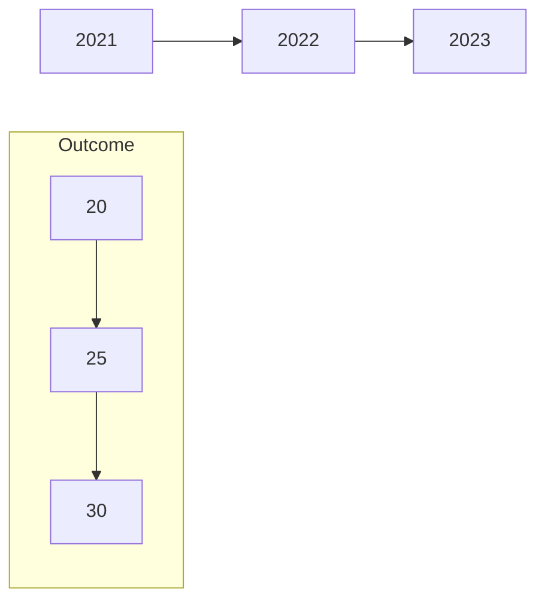
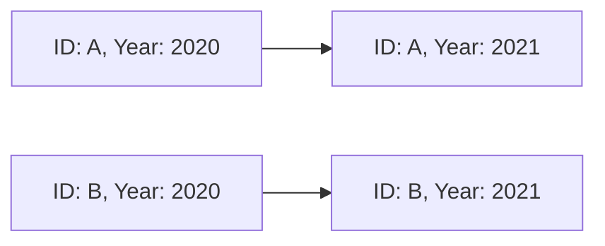

본 글은 [Korea Summer Workshop on Causal Inference 2023](https://www.youtube.com/playlist?list=PLKKkeayRo4PUyqxgszL-biEZOOA9j61HT)의 내용을 주관적으로 정리한 글입니다. 추가적인 설명이 필요한 분들을 위해 원래 영상 링크를 같이 첨부합니다. 

- 링크: [[Week 3-2] 인과추론 관점에서의 데이터구조의 이해](https://www.youtube.com/watch?v=yZOTgQfVfxQ&list=PLKKkeayRo4PUyqxgszL-biEZOOA9j61HT&index=10)

# Week 3.  Regression and Matching
## 3-2. Panel Data and Fixed Effects
### Data Structure 종류
- **Cross-sectional data**
	- 고정된 시점에 대해 다수의 유닛을 관측한 자료.
	- e.g. survey 자료 등
	- 예

- **Time-series data**
	- 고정된 유닛에 대해 다수의 시점을 관측한 자료.
	- e.g. 주가, GDP 등
	- 예

- **Panel(or longitudinal) data**
	- 다수의 유닛에 대해 다수의 시점을 관측한 자료.
	- 시간의 변화에 따라 유닛이 추적 가능해야 함(= 유닛이 달라지거나 변하지 않아야 함).
	- 예

### Counterfactual 관점의 Data Structure
- (**Remind**) Ceteris Paribus 만족    
	$\Rightarrow$ Selection bias $\simeq$ 0    
	$\Rightarrow$ Control group과 comparable    
	$\Rightarrow$ Treatment group의 counterfactual 추정 가능    
	$\Rightarrow$ Treatment Effect 추정 가능   
	
- Time-series data(; time)
	- Treatment 이전/이후의 결과 데이터가 있는 경우(=Interrupted time series model).
		- 'Treatment 이전의 데이터'와 'time trend에 대한 가정(; assumptions)'을 통해 counterfactual 추정 가능.
	- (**인과추론 관점에서의) 한계 = Control group이 없음.**
		- Treatment 이후의 변화가 time trend 때문인지, treatment의 효과 때문인지 구분하지 못함.
		- Treatment 이전의 데이터가 없으면 treatment가 없는 경우(= counterfactual)를 추정할 수 없어서 '인과추론이 불가능함'.

 - Cross-sectional data(; unit)
	 - Control group의 데이터를 통해 counterfactual 추정 가능.
	 - 단, **control group은 'time-invariant confounders'와 'time-varying confounders', 모두에 대해서 comparable 해야 함**.

- Panel data(; unit $\times$ time)
	- Control group의 데이터를 통해 counterfactual 추정 가능. 
	- 또한 **각 유닛에 대한 fixed effect를 통해 time-invariant confounders를 control** 가능 (; like control variables).
	- **Control group은 'time-varying confounders'에 대해서만 comparable을 만족하면 됨** (; 가정 완화).
	- Treatment 전후의 패널 데이터가 있는 경우
		- 유닛에 대한 fixed effects를 통해 time-invariant한 요소에 대한 설명이 가능함 $\Rightarrow$ Control group은 time-varying confounders에 대해서만 comparable을 만족하면 됨.
		- Treatment 이전/이후의 데이터를 이용해 Treatment group과 Control group 간의 차이를 time trend로 설명할 수 있다면 $\Rightarrow$ '인과추론'이 가능 ($\because$ Treatment group과 Control group 간의 차이는 time-varying한 요소).

### Fixed-Effects Model enables Within-Group Comparison
- Treatment 이후의 패널 데이터만 있는 경우
	- (유닛 fixed effect -treatment이면 1 아니면 0-인 경우) fixed effects와 treatment effects를 구분할 수 없기 때문에 인과분석이 불가능.
	- 만약 treatment의 intensity에 대한 정보가 있다면 그룹 내 비교(; **within-group comparison**) 가능 $\Rightarrow$ 인과분석 가능.
- Treatment 전후의 패널 데이터가 있는 경우
	- **Two-Way Fixed Effects(; TWFE) model** = panel 모델 w. both unit and time fixed-effects
		- unit fixed effects $\Rightarrow$ treatment group의 outcome이 treatment 이전/이후에 얼마나 더 변했는지
		- time fixed effects $\Rightarrow$ control group과 treatment group의 차이가 treatment 이전/이후에 얼마나 더 변했는지(; 커졌는지)

### Fixed-Effect Model is the Primary Workhorse for Panel data
- 전통적으로 'Hausman test'를 통해 fixed effect model을 쓸 것인지, random effect model을 쓸 것인지 결정했음.
- 하지만 **현대적 인과분석 관점에서 fixed effect model을 default로 사용하는 경향**이 있음 ($\because$ random effects로는 confounder에 대한 설명을 할 수 없음).

### Clustered Standard Errors in Panel Data Analysis
- (전통적) 회귀모델에서는 i.i.d(; independent and identically distributed) 에러를 가정함.
- 하지만 **패널 데이터의 경우에는 동일한 패널 유닛에 대한 데이터이므로, 각 패널 유닛에 대한 intercorrelation을 가정**함(; 각 유닛의 잔차가 시간 term에 대해 correlated).
