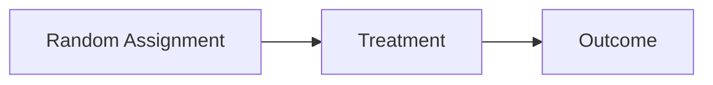
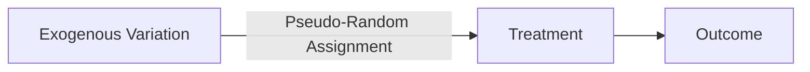

본 글은 [Korea Summer Workshop on Causal Inference 2023](https://www.youtube.com/playlist?list=PLKKkeayRo4PUyqxgszL-biEZOOA9j61HT)의 내용을 주관적으로 정리한 글입니다. 추가적인 설명이 필요한 분들을 위해 원래 영상 링크를 같이 첨부합니다. 

- 링크: [[Week 4-2] 인과추론을 위한 연구디자인](https://www.youtube.com/watch?v=guSly4Bomeo&list=PLKKkeayRo4PUyqxgszL-biEZOOA9j61HT&index=14)

# Week 4. Research Design for Causal Inference
## 4-2. Design-Based Approach
### Design-Based Approach
- 인과추론의 quality는 전적으로 research design에 의해 결정됨.

### What is Research Design for Causal Inference?
- Randomized Controlled Trial

- Quasi-Experiment(; 준실험)
	- (자연 발생한) 외부 요인에 인한 변화가 random assign과 유사한 역할을 함.
	- 이를 통해 RCT와 유사한 형태로 동작함.

- 인과분석의 성공적인 Research Design을 위한 조건들
	- '외부적 요인의 변화가 어떻게 발생했는지'에 대해 설명할 수 있어야 함.
	- Treatment assign. mechanism 또는 Selection process에 대해 이해하고 얼마나 무작위 배정과 유사한지를 설명할 수 있어야 함.
		- 외부 요인의 변화가 treatment를 결정하는 역할로만 outcome에 영향을 주어야 함. 
		- 다른 confounders를 통하거나 treatment 이외의 경로로 outcome에 영향을 주면 안됨.

### Research Design Precedes Statistical Analysis
- 관련 예제
	- 예제 1. 수도 공급과 콜레라 (quoted from Freedman 1991)
	- 예제 2. 1995 시카고 폭염
- 인과추론의 목적은 원인에 대한 intervention을 통해 outcome을 개선하는 것.

### Design Trumps Analysis
- 관측 연구는 Randomized experiments와 유사하도록 디자인 되어야 함.
- 인과분석을 위한 관측연구에 대해 확인해야 할 질문들
	- 기준으로 삼을 수 있는 (가상의) 무작위 실험은 어떤 것인지?
	- 샘플 사이즈가 적절한지?
	- Treatment assignment 매커니즘이 어떻게 되는지?
	- 중요한 covariates가 잘 측정되었는지?
	- 중요한 covariates가 균형있게 수집되었는지?