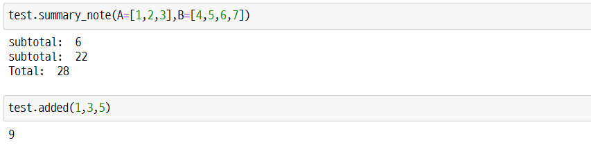

Python에서는 다양한 함수, 패키지 등이 존재하지만 부득이하게 직접 함수 등을 만들어서 사용해야하는 경우가 있습니다. 이때 import하는 파일을 모듈(module)이라고 합니다. 작성한 모듈을 어떤 식으로 불러오는지 간단한 예제를 통해서 알아보겠습니다.


먼저, 모듈에 대한 간단한 정의입니다.
  > 모듈이란 함수나 변수 또는 클래스를 모아 놓은 파일이다. 모듈은 다른 파이썬 프로그램에서 불러와 사용할 수 있게끔 만든 파이썬 파일이라고도 할 수 있다. 
  > 
  > 출처: 박응용, 『점프 투 파이썬』


# test 모듈
'test' 모듈은 다음과 같이 간단한 부분합과 전체합에 대한 함수들을 만들었습니다.

```py
def added(*args : int) -> int:
    """
    [summary]
        return the sum of ints

    Returns:
        int: some ints.
    """ 

    num=0
    for a in args:
        num+=a
    return num


def summary_note(**kwargs) -> None :
    """
    [summary]
        Print the 'subtotal' & 'total'
    """

    lst = []
    for key, value in kwargs.items():
        print(f"subtotal: ", added(*value))
        lst = [*lst,*value]

    print(f"Total: ", added(*lst))


# 인터프리터로 바로 실행할 경우
if __name__=='__main__':
    print("The output of 'summary_note(A=[1,2,3],B=[4,5,6,7])' is ...")
    summary_note(A=[1,2,3],B=[4,5,6,7])
    
# python을 실행해 패키지나 모듈로 import할 경우
else:
    print('Import the test.py')
```


# Import 및 결과
```py
import sys  
sys.path.insert(0, 'path') # import할 파일이 있는 경로로 변경

import test

test.summary_note(A=[1,2,3],B=[4,5,6,7])
test.added(1,3,5)
```

<!-- 이미지 삽입 -->



* 참고자료
  
  * [stackoverflow 글 - Import py file in another directory in Jupyter notebook](https://stackoverflow.com/questions/49264194/import-py-file-in-another-directory-in-jupyter-notebook)
  